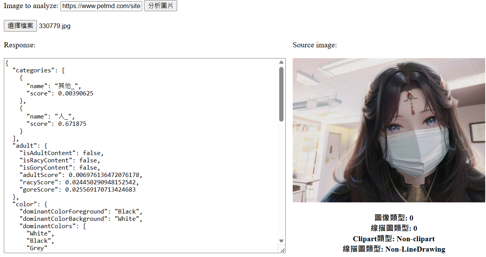

由於人工智慧發達，有許多人會借助AI來完成作業，所以我決定使用Azure Cognitive Services中的ImageType來辨別是否為剪貼圖

# 以下是我增加的程式碼

```
var imageType = data.imageType;
        if (imageType) {
            $("#picDescription").append("圖像類型: " + imageType.clipArtType + "<br>");
            $("#picDescription").append("線描圖類型: " + imageType.lineDrawingType + "<br>");

            // 添加对应的文字描述
            var clipartTypeText;
            switch (imageType.clipArtType) {
                case 0:
                    clipartTypeText = "Non-clipart";
                    break;
                case 1:
                    clipartTypeText = "ambiguous Clipart";
                    break;
                case 2:
                    clipartTypeText = "normal-clipart";
                    break;
                case 3:
                    clipartTypeText = "good-clipart";
                    break;
                default:
                    clipartTypeText = "uncertain";
                    break;
            }
            $("#picDescription").append("Clipart類型: " + clipartTypeText + "<br>");

            var lineDrawingTypeText;
            switch (imageType.lineDrawingType) {
                case 0:
                    lineDrawingTypeText = "Non-LineDrawing";
                    break;
                case 1:
                    lineDrawingTypeText = "LineDrawing";
                    break;
                default:
                    lineDrawingTypeText = "uncertain";
                    break;
            }
            $("#picDescription").append("線描圖類型: " + lineDrawingTypeText + "<br>");
        }
```





